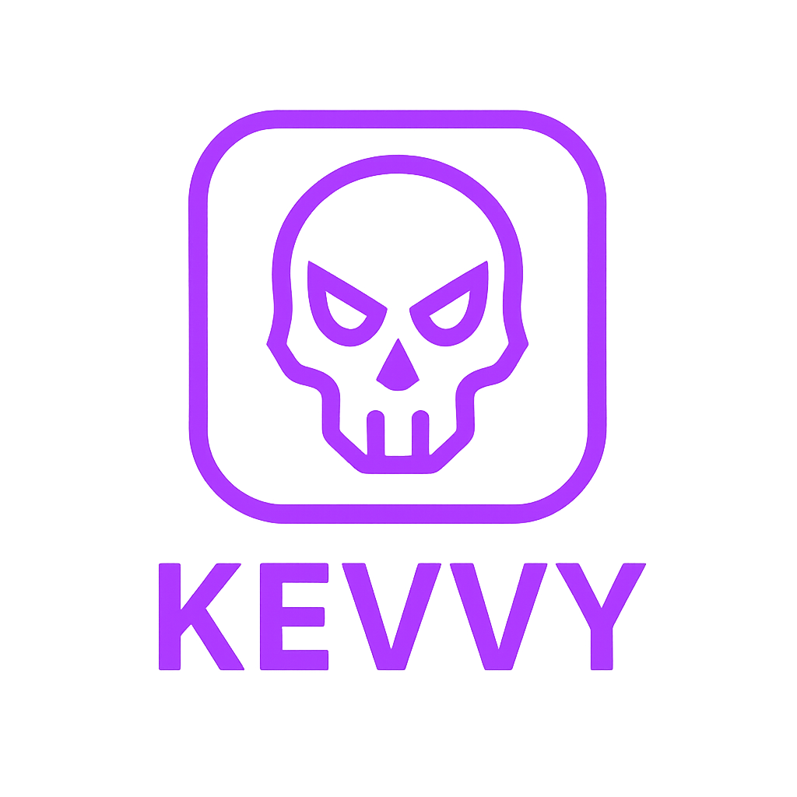

<h1 align="center">
  <a href="https://github.com/mauvehed/kevvy">
    
  </a>
</h1>

<div align="center">
  A Discord bot for searching the Common Vulnerabilities and Exposures (CVE) list and providing KEV updates.
</div>

<div align="center">
<br />

<a href= "https://discord.com/api/oauth2/authorize?client_id=1363214368648724630&permissions=277025459200&scope=bot%20applications.commands">
  

[](https://github.com/mauvehed/kevvy/actions/workflows/codeql-analysis.yml)
[](https://www.codacy.com/gh/mauvehed/kevvy/dashboard)
[](LICENSE)

</div>

<details open="open">
<summary>Table of Contents</summary>

- [About](#about)
  - [Built With](#built-with)
  - [Usage](#usage)
  - [Screenshots](#screenshots)
- [Getting Started](#getting-started)
  - [Prerequisites](#prerequisites)
  - [Configuration](#configuration)
  - [Running with Docker (Recommended)](#running-with-docker-recommended)
  - [Running Locally with Poetry](#running-locally-with-poetry)
- [Roadmap](#roadmap)
- [Support](#support)
- [Contributing](#contributing)
- [Authors & contributors](#authors--contributors)
- [Security](#security)
- [License](#license)
- [Acknowledgements](#acknowledgements)

</details>

---

## About

**kevvy** is a Discord bot with two main functions:

1.  **Automatic CVE Detection:** It automatically monitors chat messages for CVE (Common Vulnerabilities and Exposures) identifiers (e.g., `CVE-2023-12345`). When a CVE is detected, the bot fetches detailed information primarily from the [VulnCheck API](https://vulncheck.com/) (if an API key is provided). If VulnCheck is unavailable or doesn't return data, it falls back to the [NIST National Vulnerability Database (NVD) API v2.0](https://nvd.nist.gov/developers/vulnerabilities).
2.  **Direct CVE Lookup:** Users can explicitly request details for a specific CVE using the `/cve lookup` command.

Additionally, the bot can monitor the [CISA Known Exploited Vulnerabilities (KEV) catalog](https://www.cisa.gov/known-exploited-vulnerabilities-catalog). Server administrators can enable this feature per server using slash commands, designating a channel for new KEV alerts.

Key features:
*   Automatic detection of CVE IDs in messages.
*   Direct lookup of specific CVEs via `/cve lookup`.
*   Fetches details primarily from VulnCheck (if available), falling back to NVD.
*   Displays CVSS score (v3.1/v3.0/v2.0), vector string, description, publication dates, CWEs, and reference links.
*   Consolidates responses for messages containing multiple CVEs (max 5 embeds per message by default) to prevent spam.
*   Optionally checks the CISA KEV catalog periodically and posts alerts for new entries to a designated channel (configurable per server).

### Built With

*   
*   
*   
*   
*   
*   
*   
*   

## Usage

1.  **Invite the Bot:** Invite the configured bot to your Discord server.
2.  **Automatic Detection:** Simply type or paste a message containing one or more CVE IDs (e.g., `Check out CVE-2024-1234 and CVE-2024-5678`). The bot will automatically detect them and post embed(s) with the details.
    *   If multiple unique CVEs are in one message, the bot will post details for up to 5 of them (by default) and indicate if more were found.
3.  **Direct Lookup:** Use the slash command `/cve lookup cve_id:<CVE-ID>` (e.g., `/cve lookup cve_id:CVE-2024-0001`) to get details for a specific vulnerability.
4.  **CISA KEV Alerts (Optional Setup):**
    *   `/kev enable channel:<#your-alert-channel>`: A server administrator with 'Manage Server' permissions can run this command to enable KEV monitoring and designate a specific channel for alerts.

## Screenshots

Here's the bot in action:

**Automatic CVE Detection and Information:**


**CISA KEV Alert Notification:**


## Getting Started

### Prerequisites

*   **Docker** and **Docker Compose** (Recommended for running)
*   OR **Python 3.10+** and **Poetry** (For local development/running)
*   A **Discord Bot Token**. You can create a bot and get a token from the [Discord Developer Portal](https://discord.com/developers/applications).

### Configuration

The bot is configured using environment variables. Create a `.env` file in the project root by copying the example:

```bash
cp .env.example .env
```

Then, edit the `.env` file:

*   `DISCORD_TOKEN` (Required): Your Discord bot token.
*   `NVD_API_KEY` (Optional): Your NVD API key. Request one [here](https://nvd.nist.gov/developers/request-an-api-key) for significantly higher request rate limits. Used as a fallback data source if VulnCheck is unavailable or fails.
*   `VULNCHECK_API_TOKEN` (Optional): Your VulnCheck API key. Get one from [VulnCheck](https://vulncheck.com/). If provided, VulnCheck becomes the *primary* data source for CVE details.
*   `DISCORD_COMMAND_PREFIX` (Optional): The prefix for traditional commands (if any are added later). Defaults to `!`. The primary interaction is automatic detection and slash commands.
*   `LOGGING_CHANNEL_ID` (Optional): The ID of the Discord channel to which log messages should be sent.
*   `DISABLE_DISCORD_LOGGING` (Optional): Set to `true` to disable sending logs to the Discord channel specified by `LOGGING_CHANNEL_ID`. Defaults to `false`.

### Running with Docker (Recommended)

1.  Ensure Docker and Docker Compose are installed.
2.  Make sure you have configured your `.env` file.
3.  Pull the latest image and start the container in detached mode:
    ```bash
    docker-compose up -d
    ```
    _(This will automatically pull the `ghcr.io/mauvehed/kevvy:latest` image if you don't have it locally)._
    
4.  To view logs:
    ```bash
    docker-compose logs -f
    ```
5.  To stop the container:
    ```bash
    docker-compose down
    ```

### Running Locally with Poetry

1.  Ensure Python 3.10+ and Poetry are installed.
2.  Clone the repository:
    ```bash
    git clone https://github.com/mauvehed/kevvy.git
    cd kevvy
    ```
3.  Install dependencies:
    ```bash
    poetry install
    ```
4.  Configure your `.env` file.
5.  Run the bot:
    ```bash
    poetry run python main.py
    ```

## Roadmap

See the [open issues](https://github.com/mauvehed/kevvy/issues) for a list of proposed features (and known issues).

- [Top Feature Requests](https://github.com/mauvehed/kevvy/issues?q=label%3Aenhancement+is%3Aopen+sort%3Areactions-%2B1-desc) (Add your votes using the 👍 reaction)
- [Top Bugs](https://github.com/mauvehed/kevvy/issues?q=is%3Aissue+is%3Aopen+label%3Abug+sort%3Areactions-%2B1-desc) (Add your votes using the 👍 reaction)
- [Newest Bugs](https://github.com/mauvehed/kevvy/issues?q=is%3Aopen+is%3Aissue+label%3Abug) (Squash Em!)

## Support

Reach out to the maintainer at one of the following places:

- Contact options listed on [this GitHub profile](https://github.com/mauvehed)
- @mauvehed just about anywhere else online

## Contributing

First off, thanks for taking the time to contribute! Contributions are what make the open-source community such an amazing place to learn, inspire, and create. Any contributions you make will benefit everybody else and are **greatly appreciated**.


Please read [our contribution guidelines](docs/CONTRIBUTING.md), and thank you for being involved!

## Authors & contributors

The original setup of this repository is by [mauvehed](https://github.com/mauvehed).

For a full list of all authors and contributors, see [the contributors page](https://github.com/mauvehed/kevvy/contributors).

## Security

- **kevvy** follows good practices of security, but 100% security cannot be assured.
- **kevvy** is provided **"as is"** without any **warranty**. Use at your own risk.

_For more information and to report security issues, please refer to our [security documentation](docs/SECURITY.md)._

## License

This project is licensed under the **MIT license**.

See [LICENSE](LICENSE) for more information.

## Acknowledgements

*   Data sourced primarily from [VulnCheck](https://vulncheck.com/) (when configured).
*   Fallback CVE data lookup via [NVD](https://nvd.nist.gov).
*   Known Exploited Vulnerabilities feed monitored via [CISA](https://www.cisa.gov/known-exploited-vulnerabilities-catalog).
*   Thanks to all contributors and users who have helped make this project better!

